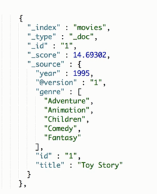
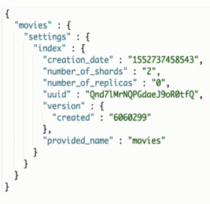
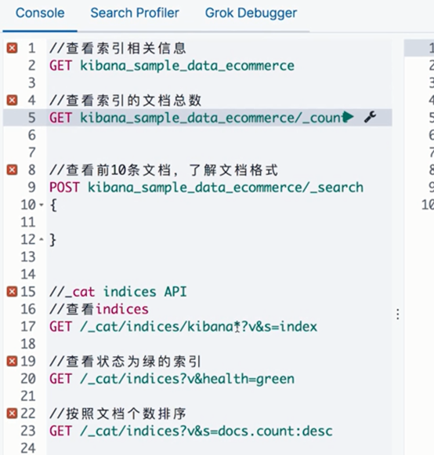
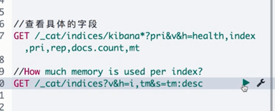
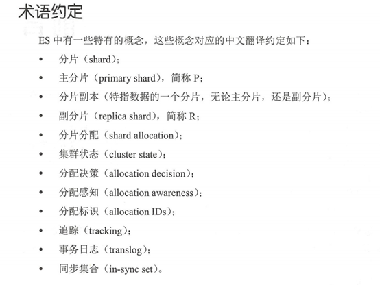

文档(Document)

Elasticsearch是面向文档的,文档是所有可搜索数据的最小单元

文档会被序列化成JSON格式,保存在Elasticsearch中

JSON对象由字段组成,每个字段有对应的字段类型(字符串/数值/布尔/日期/二进制/范围类型)

每个文档文档都有一个UniqueID

你可以自己指定ID,或者通过ES自动生成.

JSON文档 

一篇文档包含了一系列的字段,类似于数据库表中的一条记录.

JSON文档,格式灵活,不需要预先定义格式:字段的类型可以指定或者通过ES自动推算,支持数组/支持嵌套

文档的元数据

元数据,用于标注文档的相关信息:

_index - 文档所属的索引名

_type - 文档所属的类型名(已废除)

_id - 文档唯一id

_source: 文档的原始Json数据

_all: 整从事所有字段内容到该字段,已被废除

_score:相关性打分

索引(index)

索引是文档的容器,是一类文档的结合

index体现了逻辑空间的概念:每个索引都有自己的Mapping定义,用于定义包含文档的字段名和字段类型

shard体现了物理空间的概念:索引的数据分散在shard上

索引的mapping与settings

mapping定义文档字段的类型

setting定义不同的数据分布

索引的不同语意:

名词:一个ES集群中,可以创建很多个不同的索引

动词:保存一个文档到ES的过程也叫索引(indexing)

名词:一个B树索引,一个倒排索引

类型(Type)

在7.0之前,一个index可设置多个Types

6.0开始,Type已经被Deprecated.7.0开始,一个索引只能创建一个Type就是`_doc`

抽像类比

| RDBMS  | ES       |
| ------ | -------- |
| Table  | Index    |
| Row    | Document |
| Column | Field    |
| Schema | Mapping  |
| SQL    | DSL      |

为何去掉type

https://www.elastic.co/cn/blog/moving-from-types-to-typeless-apis-in-elasticsearch-7-0

cat index api

https://www.elastic.co/guide/en/elasticsearch/reference/7.1/cat-indices.html